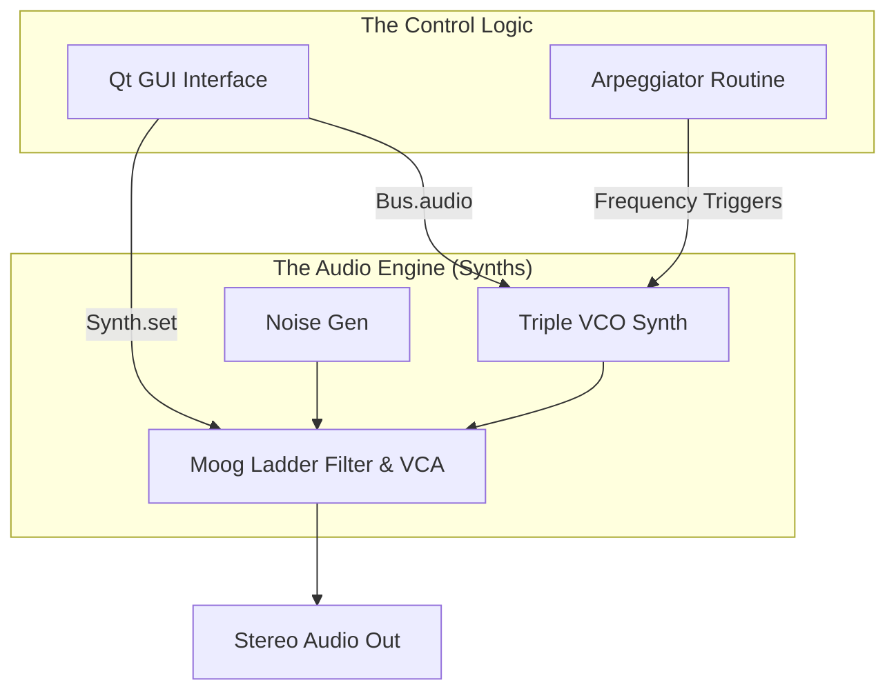

# Minimoog Emulator (SuperCollider)

A high-fidelity virtual analog synthesizer built entirely in **SuperCollider**. This project recreates the iconic signal path, harmonic richness, and user experience of the legendary Moog Minimoog Model D, optimized for desktop use without external MIDI hardware.

---

## Overview
This emulator is a complete software instrument featuring a triple-oscillator synthesis engine and a custom GUI. It allows for deep sound design through real-time manipulation of filters, envelopes, and a built-in arpeggiator.

### Key Highlights:
* **True Triple-Oscillator Design:** Independently controllable VCOs with multiple waveforms.
* **Moog Ladder Filter Modeling:** Implementation of the `MoogFF` UGen for authentic 24dB/octave resonant filtering.
* **Integrated Arpeggiator:** Custom SuperCollider `Routine` supporting Major, Minor, and Up/Down patterns.
* **On-Screen Performance:** A 44-key interactive GUI keyboard for immediate playability.

---

## Technical Architecture

The system uses a modular approach, separating audio generation from control logic to ensure low-latency performance.

---

## DSP Details

* **Oscillators**: Built using LFTri, LFSaw, and Pulse UGens. Also a noise generator is present.
* **Filter Path**: Uses a specialized Filter Envelope mapped to the MoogFF cutoff frequency via a contour amount.
* **Amplification**: Employs a dedicated ADS envelope with custom curve shapes to mimic analog capacitor discharge.

---

## Getting Started

### Prerequisites

* SuperCollider (Tested on version 3.12+)
* A running SuperCollider Server (scsynth).

### Installation & Execution

1. **Clone the repo**
2. **Open the script**: Launch MiniMoogEmulator.scd in the SuperCollider IDE.
4. **Run Program**: Select the code block into external round parenthesis and press Ctrl+Enter.
5. **Play**: Choose a waveform, turn up the Oscillator Gain, and click the GUI keys!

---

## Development & Best Practices
* **State Management**: The project uses Environment Variables (~) for global synth nodes and audio buses to allow for dynamic real-time updates.
* **Clean Code**: Variables are lexically scoped at the start of blocks to ensure efficient compilation and readability.
* **UI/UX**: The interface uses a custom drawFunc() to create the classic Moog panel aesthetics using Pen stroke rectangles.

---

## Contributing
Contributions are welcome! Here are the classical instructions to work on the project.

1. Fork the Project.
2. Create your Feature Branch.
3. Open a Pull Request.

There are fex topics that could be developed but you can come with whatever you want:
* MIDI support
* Improve Ladder filter
* Improve filter resonance curve
* Add new arpeggio patterns
* Add glide
